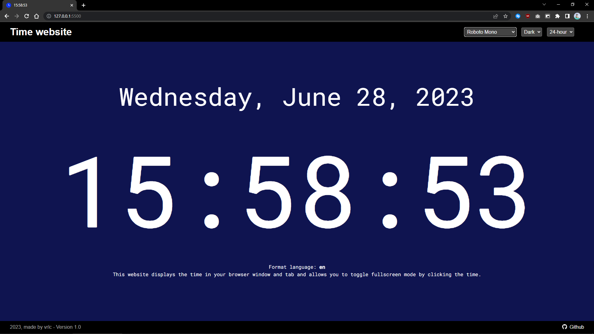
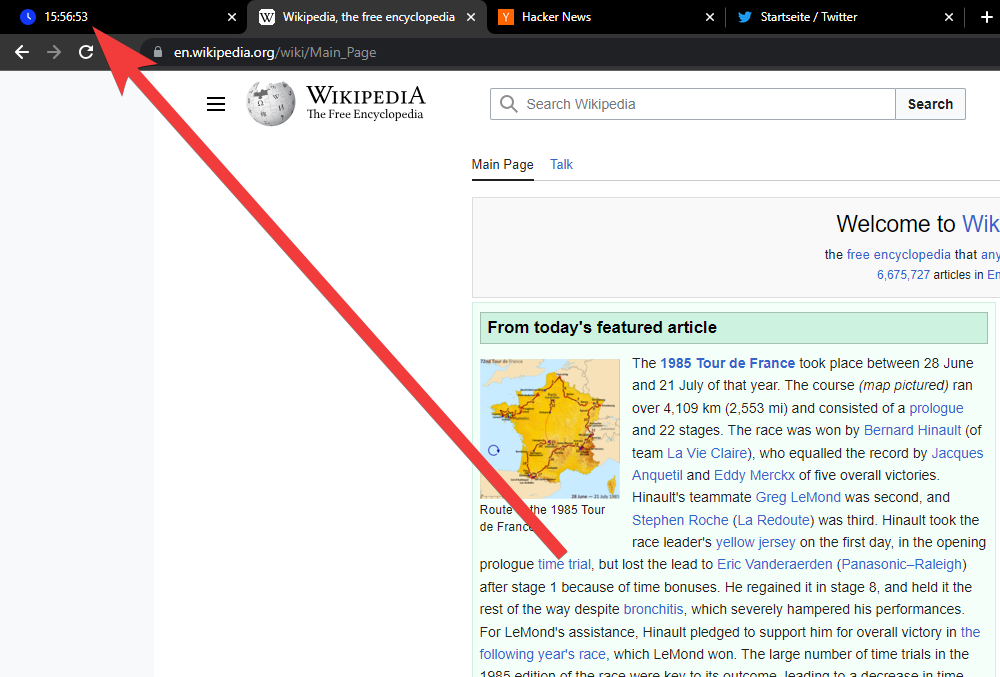
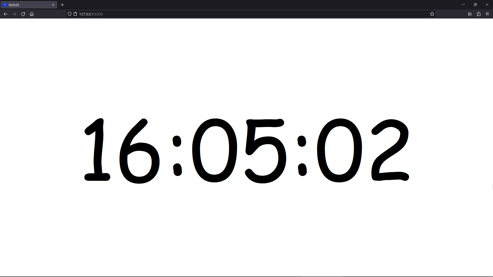
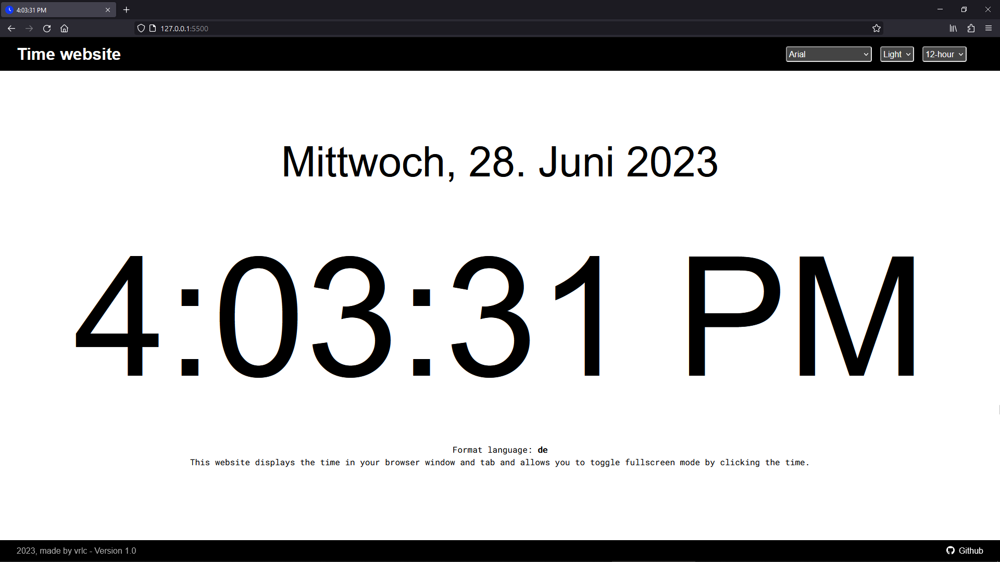

# Time website

## [Click here to visit the website](https://time-on-tab.vercel.app/)

This website provides a unique way to display the time directly in your computer's browser window and browser tab in real time.

The purpose for this website is to see the time on your browser tab without needing the taskbar on your Windows or Linux operating system.

Additionally, it offers a toggle option to switch to fullscreen mode by simply clicking on the displayed time.

You can customize your window by changing the color mode in light or dark, select a variety of fonts and toggle either the 12- or 24-hour time format.

Additional features and bugfixes will be coming soon.

Sincerely

vrlclk ❤
